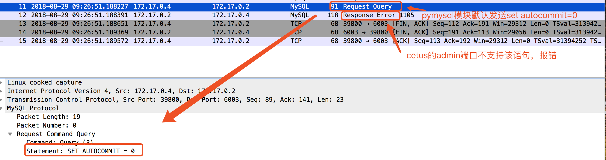
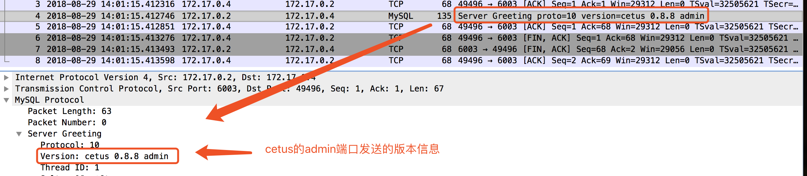
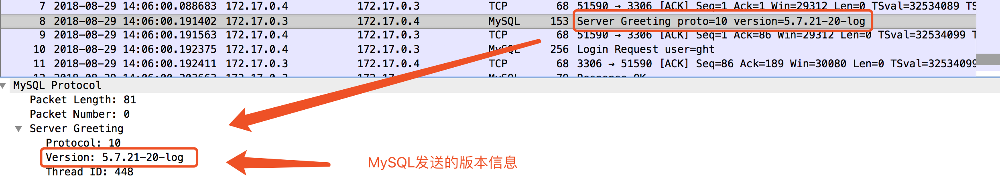
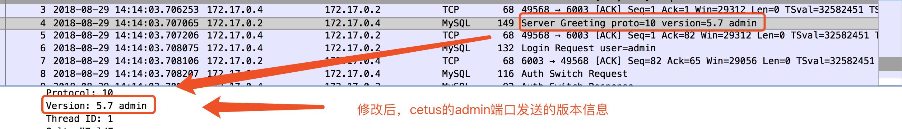

### Cetus的admin端口对Python的适配

#### 1 概述

Cetus是北京网易乐得DBA团队和SA团队联合打造的一款MySQL数据库中间件。Cetus具有读写分离版本和分库版本，已经部署在网易乐得部门众多线上MySQL集群，性能和稳定性均表现良好。其开源地址为:https://github.com/Lede-Inc/cetus，欢迎star关注。

本文主要对cetus的admin端口如何适配Python的pymysql和MySQLdb模块进行描述。其他软件可能也会遇到类似问题，因此对适配思路进行描述，遇到类似问题的同学可以借鉴。

#### 2 背景描述

cetus中间件对外暴露了两类端口：admin端口，用于对cetus进行管理、监控；proxy端口，用于与MySQL进行sql交互。

通常会通过一些脚本与cetus的admin端口交互，用于自动化的数据监控或是通过界面设置变量属性等。该类脚本通常使用Python语言编写，而Python的某些mysql 驱动模块会默认发送一些额外的语句，但是admin端口只能识别预定的几个语句，其他语句变会报错。从而导致Python连接cetus的admin端口失败，影响cetus集成到管理平台。

基于上述背景，我们有选择的对常用的Python的pymysql和MySQLdb模块进行了适配，下文将以适配pymysql为例描述适配过程。以下使用的Python版本为Python 2.7.5。


#### 3 pymysql的适配

使用pymysql模块连接cetus的admin端口时，报错如下:

```
Traceback (most recent call last):
  File "./conpymysql.py", line 5, in <module>
    conn = connector.connect(host="172.17.0.2", user="admin", passwd="admin", port=6003)
  File "/usr/lib/python2.7/site-packages/pymysql/__init__.py", line 94, in Connect
    return Connection(*args, **kwargs)
  File "/usr/lib/python2.7/site-packages/pymysql/connections.py", line 327, in __init__
    self.connect()
  File "/usr/lib/python2.7/site-packages/pymysql/connections.py", line 611, in connect
    self.autocommit(self.autocommit_mode)
  File "/usr/lib/python2.7/site-packages/pymysql/connections.py", line 389, in autocommit
    self._send_autocommit_mode()
  File "/usr/lib/python2.7/site-packages/pymysql/connections.py", line 407, in _send_autocommit_mode
    self._read_ok_packet()
  File "/usr/lib/python2.7/site-packages/pymysql/connections.py", line 396, in _read_ok_packet
    pkt = self._read_packet()
  File "/usr/lib/python2.7/site-packages/pymysql/connections.py", line 683, in _read_packet
    packet.check_error()
  File "/usr/lib/python2.7/site-packages/pymysql/protocol.py", line 220, in check_error
    err.raise_mysql_exception(self._data)
  File "/usr/lib/python2.7/site-packages/pymysql/err.py", line 109, in raise_mysql_exception
    raise errorclass(errno, errval)
pymysql.err.InternalError: (1105, u"syntax error, 'select help' for usage")
```

从错误堆栈信息中不难发现，pymysql模块发送了autocommit语句，由于admin端口不支持该语句，所以连接失败。为了验证，对连接过程抓包，抓包信息如下：



根据抓包信息，确实是pymysql模块建立连接之后，默认发送了set autocommit=0语句，造成admin端口连接失败。因此，需要想办法让pymysql模块不发送autocommit语句。

简单查看pymysql源码，在连接建立过程中，有如下代码（connections.py connect(self, sock=None)）：

```
if self.autocommit_mode is not None:
    self.autocommit(self.autocommit_mode)
```

上述源码显示，发送set autocommit=0是通过参数控制的，控制的参数如下：

> autocommit=None

当使用上述参数禁用pymysql建立连接发送autocommit语句后，又出现新的错误：

```
Traceback (most recent call last):
  File "./conpymysql.py", line 5, in <module>
    conn = connector.connect(host="172.17.0.2", user="admin", passwd="admin", port=6003, autocommit=None)
  File "/usr/lib/python2.7/site-packages/pymysql/__init__.py", line 94, in Connect
    return Connection(*args, **kwargs)
  File "/usr/lib/python2.7/site-packages/pymysql/connections.py", line 327, in __init__
    self.connect()
  File "/usr/lib/python2.7/site-packages/pymysql/connections.py", line 598, in connect
    self._request_authentication()
  File "/usr/lib/python2.7/site-packages/pymysql/connections.py", line 783, in _request_authentication
    if int(self.server_version.split('.', 1)[0]) >= 5:
```

同样查看pymysql源码，有如下代码（connections.py）：

```
def _request_authentication(self):
    # https://dev.mysql.com/doc/internals/en/connection-phase-packets.html#packet-Protocol::HandshakeResponse
    if int(self.server_version.split('.', 1)[0]) >= 5:
        self.client_flag |= CLIENT.MULTI_RESULTS

```

通过代码不难知道，pymysql会获得server端传过来的版本号，然后根据版本号设置client_flag标志。因此，抓包看cetus的admin端口实际发送的版本信息是什么，抓包结果如下：



而实际MySQL发送的版本信息的格式如下所示：



因此，在cetus代码中，将admin端口发送的版本信息修改成以版本号开头的格式即可，修改后发送的版本号信息，抓包如下：



通过上述两点修改，Python使用pymysql就可以正常的与cetus的admin端口进行交互了。

下面是一段使用Python的pymysql模块连接cetus的admin端口的示例：

```
#!/usr/bin/python
# -*- coding: utf-8 -*-
import pymysql as connector

conn = connector.connect(host="172.17.0.2", user="admin", passwd="admin", port=66
003, autocommit=None)
cursor = conn.cursor()
cursor.execute("show maintain status")
data = cursor.fetchone()
print "status: %s" %data
```

#### 4 总结

cetus的admin端口适配pymysql过程很简单，重在思路，希望给遇到同样问题的同学一些借鉴。当然，如果在使用cetus过程中有适配其他模块需求，我们也十分愿意帮助解决，欢迎大家持续关注cetus中间件，关注网易乐得。