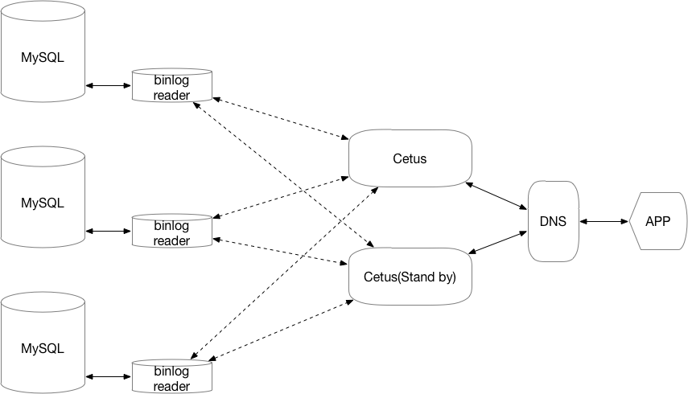
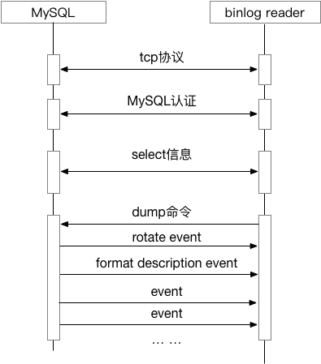

### Cetus强一致性读设计方案（v1）

#### 1 解决的问题

有些业务场景是：写后立即读，要求能够读取到写入的数据。当MySQL集群中存在从库时，默认读流量会被中间件路由到从库上，一旦主从复制存在延迟，有可能出现脏读或是读取不到数据。

如果写数据和读数据的SQL均使用同一个连接操作，业界有以下解决方案：

1 有些中间件的解决方案是：强制写数据（effected-rows>0）后的第一条查询路由到主库，从而保障该场景下读到最新的数据。但是这种实现，势必增加主库压力。

2 有些中间件的解决方案是：业务代码中，对这些查询SQL增加一些注释（hint），中间件解析这些注释，将带该类注释的SQL路由到主库。该实现方案，同样也会增加一些主库压力，且要求开发和DBA十分了解业务逻辑。

如果写数据和读数据的SQL来自不同的连接，proxysql的解决方案如下：

中间件实时获取各个从库上的GTID集合。当中间件向后端执行了一些SQL，MySQL5.7.5协议会返回最近一条写/更新操作的GTID，从而后续的查询，可以路由到已经包含了该最新写入的GTID的从库，从而实现了一致性读。

Cetus会参考该思路，设计并实现一致性读功能。

#### 2 方案的制定

实现强一致性读的核心是：1 获取最近一条写/更新操作的GTID；2 获取从库的GTID集合。MySQL5.7.5及其之后的协议已经支持第1点，因此重点讨论第2点的方案。

一般获取GTID的方式有两种:1 pull方式，周期性的查询各个MySQL的GTID的集合，类似于Cetus目前的monitor线程；2 push方式，每当MySQL上有新的事件并生成GTID时，会主动地通知中间件。

上述两种形式，第1种明显时效性较差，因为获取GTID的实时精度，取决于间隔的长短。因此考虑使用第2中方式实现。

考虑当Cetus集群中有多个Cetus实例，或是多进程模式时，每个Cetus都会向各个MySQL实例请求binlog信息。这有两点问题：1 binlog传输量巨大，会对网络带宽造成压力；2 每个Cetus都向MySQL实例获取binlog信息，一旦Cetus实例（或是多进程版本进程数过多），会造成MySQL的压力增加（因为MySQL主从复制时，会对每个slave都建立一个单独的线程），也影响Cetus的水平扩展（或是进程数增加）。

因此，需要一个获取binlog的代理程序，为了减少网络负载，该代理程序应该部署与MySQL实例相同的机器上。该代理程序伪装成从库，向主库请求binlog，并分析出所携带的GTID集合。各个Cetus实例（或是多进程版本的各个子进程）会向该代理请求GTID集合，而此时代理只需要向各个请求GTID集合的Cetus发送GTID集合即可，而非全部的binlog，从而大大减少了网络带宽。

上图中，binlog reader标志便是MySQL的代理，为各个Cetus提供GTID的信息。

#### 3 binlog reader的功能设计

binlog reader按功能主要有三个主要模块：1 伪装成slave，向MySQL请求binlog，其中使用的协议是dump协议；2 分析获取的binlog信息，提取GTID信息；3 作为代理，响应所有Cetus对GTID的请求。

- 模块1 

主要是实现MySQL dump协议，协议主要流程如下：

- 模块2

主要是提取binlog中的GTID字段信息。考虑到binlog reader 本身有可能被重启之类，定期应该将获取的GTID集合实例化到本地文件，这样一旦binlog reader重启，不需要再重新从主库获取binlog，大大增加效率。

- 模块3

考虑到多进程版本，应该参考MySQL实现方式，每个请求GTID的cetus进程，单独使用一个线程进行dump，这样可以增加实时性和响应速度。

#### 4 命令设计

- binlog reader

由于其需要其伪装成slave，因此其应该提供管理端口，进行GTID集合以及复制命令的设计。计划支持的命令有：

1 查看当前复制状态、配置和延迟情况等 slow slave status;

2 清空所有配置和GTID集合信息 reset slave;

3 设置复制配置 change master to; (不需要考虑多主复制)

4 查看所有Cetus复制情况 show dump list;

5 开启关闭 start slave; stop slave;

- Cetus

由于Cetus 会从binlog reader上获取GTID集合信息，计划支持的命令有：

1 设置复制配置 change master to ... where index = ; （按照每个backend维度设置）

2 清空所有配置和GTID集合信息 reset slave;

3 查看复制状态 slow slave status;

4 开启关闭 start slave; stop slave;

#### 5 约定

支持强一致性读功能，需要满足以下条件：

1 需要使用GTID模式

2 且需要MySQL版本是5.7.5及其以上版本

3 binlog格式需要row格式

4 后端的MySQL需要时Oracle或是Percona版本的，Mariadb暂时不支持

#### 参考

- [GTID consistent reads](http://www.proxysql.com/blog/proxysql-gtid-causal-reads)
- [基于GTID追踪的自适应路由查询](http://blog.51cto.com/l0vesql/2093871)

