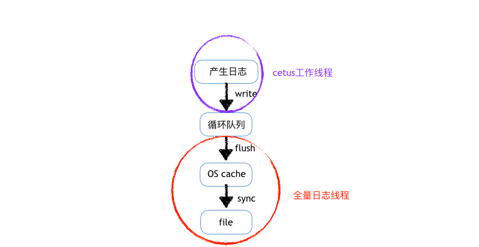
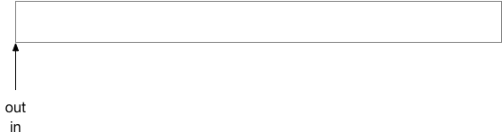
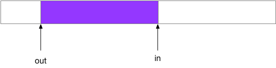

### Cetus全量日志模块用法及实现介绍

#### 1 概述

Cetus是北京网易乐得DBA团队和SA团队联合打造的一款MySQL数据库中间件。Cetus具有读写分离版本和分库版本，已经部署在网易乐得部门众多线上MySQL集群，性能和稳定性均表现良好。其开源地址为:https://github.com/Lede-Inc/cetus，欢迎star关注。

本文主要介绍cetus全量日志的常见用法，方便用户通过其来排查问题；本文也对全量日志的实现细节进行了简单介绍，使用更好的使用该功能。当然，全量日志也可以做审计等用途，但是本文侧重介绍使用全量日志进行问题的排查。

#### 2 全量日志的目的

cetus中间件在排查问题过程中，通常使用两种方法：1 tcpdump抓包 2 编译debug版本，打印所有debug信息。第1种方法虽然可以线上抓取数据包，但往往出现的问题都是上下文相关的，因此仅仅通过短暂数据包的抓取不便排查问题，且需要了解数据包分析方法；第2种方法通常用于可以测试环境中复现的问题的定位，无法线上实时使用该功能定位问题，需要重新编译、部署cetus。

全量日志可以记录整个连接发送的sql请求，不但可以对上下文进行追溯，还记录了每次sql请求该连接所处的状态，可以辅助问题排查。全量日志可以实时开启或是实时关闭，一旦线上出现问题，即可开启全量日志，通过分析日志从而定位问题。

全量日志通常解决的是上下文相关的问题。下面将介绍全量日志的使用方法。

#### 3 全量日志基本用法

全量日志的用法在github上有专门文档描述：https://github.com/Lede-Inc/cetus/blob/master/doc/cetus-sqllog-usage.md。本章节只是简单介绍重要的几个参数和操作。

- 日志模式

全量日志有三种模式（sql-log-mode）：connect、client、backend。connect模式主要用于记录客户端连接在建立连接（发送认证包）时的状态信息，可以通过该模式查看客户端连接建立之初的一些属性信息；client模式除了记录连接的属性信息外，也会记录客户端发送的原始sql；backend模式则记录的是cetus发送到后端MySQL的真正的sql（该sql有可能是经过cetus改写过的），并且只有后端MySQL将结果集全部返回后，才会记录该模式的日志。

- 日志容量

考虑到全量日志记录的数据量非常大，因此默认单个全量日志的日志文件最大容量为1G左右，可以通过参数sql-log-maxsize来调整单个日志文件最大容量，单位是M；当日志文件量超过最大容量，会进行rotate操作，默认历史全量日志保存个数为3个，可以通过参数sql-log-maxnum进行调整。因此，在使用全量日志的时候，合理设置这些参数，防止磁盘写满、报警。

- 日志操作

可以通过登录cetus的admin端口，可以查看、开启、关闭全量日志。全量日志会影响一些性能，因此在不使用的时候，动态关闭。

> \#查看全量日志
> 
> sql log status;
>
> \#开启全量日志
> 
> config set sql-log-switch = "on";
> 
> sql log start;
> 
> \#关闭全量日志
> 
> sql log stop;
> 
> config set sql-log-switch = "off";


#### 4 全量日志应用举例

全量日志记录了各个客户端和server端连接的上下文信息，可以方便的进行问题分析和统计，下面举几个例子。


##### 4.1 上下文追溯

全量日志中C\_id相同的，都是同一个客户端连接，且日志内容是顺序记录的；同理S\_id相同的，则是同一个MySQL端连接，日志内容同样是顺序记录的。因此，可以通过该标志来追溯上下文信息，即查看这个连接都发送了哪些sql。

例如业务RD反馈插入数据报错“Incorrect string value:\xF0\x9F”，有可能是业务代码框架隐式发送了set names utf8，却插入了emoji表情。这样就可以追溯该连接的上下文，来确定是否业务代码发送了set names utf8之类的语句，从而定位问题。

```
## 假设用户sql-log-mode设置为“client” 

# 查看id为23的客户端连接发送过来的所有sql
grep "#client#"  cetus-29360.clg | grep "C_id:23" | less
```

##### 4.2 统计sql响应时间分布

经常也会统计sql执行的时间分布，方便进行慢sql优化。

```
## 假设用户sql-log-mode设置为“backend”，且使用的是读写分离版本的cetus

# 根据sql执行时间统计：(, 1ms] (1ms, 2ms] (2ms, 4ms] (4ms, 8ms] (8ms, 16ms] (16ms, 32ms] (32ms, 64ms] (64ms, 128ms] (128ms, ) total   大于64ms的sql占比
grep "#backend-rw#" cetus-29360.clg|awk 'BEGIN {c1=0;c2=0;c4=0;c8=0;c16=0;c32=0;c64=0;c128=0;c=0}{split($16, flag, ":"); split(flag[2], latency, "("); if(latency[1] <= 1) {c1=c1+1;} if(latency[1]>1 && latency[1]<=2) {c2++;} if(latency[1]>2 && latency[1]<=4) {c4++;} if(latency[1]>4 && latency[1]<=8) {c8++;} if(latency[1]>8 && latency[1]<=16) {c16++;}  if(latency[1]>16 && latency[1]<=32) {c32++;} if(latency[1]>32 && latency[1]<=64) {c64++;} if(latency[1]>64 && latency[1]<=128) {c128++;} if(latency[1]>128) {c++;}} END{print c1, c2, c4, c8, c16, c32, c64, c128, c, (c1+c2+c4+c8+c16+c32+c64+c128+c), (c128+c)/(c1+c2+c4+c8+c16+c32+c64+c128+c)}'

# 统计执行时间大于 100ms的所有日志
grep "#backend-rw#" cetus-29360.clg|awk '{split($16, flag, ":"); split(flag[2], latency, "("); if (latency[1] > 100) {print }}'|less
```

##### 4.3 统计不同业务IP发送的sql请求数量

当客户端程序部署在多个客户端节点时，有时可能也会统计下不同客户节点访问cetus的比例；或是某个业务节点下线，可以通过cetus全量日志可以确定是否还有该业务节点的访问。

```
## 假设用户sql-log-mode设置为“client” 

# 根据各个客户端ip统计各业务客户端的访问次数
grep "#client#" cetus-29360.clg|awk '{print $4}'|awk -F ':' '{print $2}'|sort |uniq -c |sort -nr
```

#### 5 全量日志设计实现

全量日志设计的时候考虑到其主要有三个特点：1 日志产生频率很高，数据量十分大； 2 cetus调用全量日志接口时不能阻塞； 3 目前cetus版本的工作线程只有一个，即单线程产生日志。

根据上述特点，设计时仅让日志产生线程将日志刷入缓存，再由专门的刷日志的线程将缓存数据落盘。在日志产生线程调用接口将日志刷入缓存时，不能阻塞，因此采用丢弃策略，即一旦缓冲区满，则丢弃部分日志，保证cetus工作线程无任何阻塞。根据上述描述，日志的生产者和消费者均各自是1个线程，因此为了避免缓冲区使用锁降低性能，缓冲区采用无锁循环队列。即如下图所示：



循环队列的实现是重点，着重介绍。

循环队列的实现，使用的是一块连续的内存空间，假设该空间分配了size字节，该内存起始位置为p。该连续内存空间中有两个**无符号整型**计数器，分别标识已经写入的数据量in，以及已经读取的数据量out。由于使用了连续空间模拟循环队列，因此每次将缓存刷入磁盘的地址为：pf = p + out & (size - 1)，每次将产生的日志写入缓存的内存地址为：pw = p + in & (size - 1)。因此重点保证in 和 out的正确性，以及如何判断循环队列是空或是满。

初始情况下in = out = 0，此时当前内存可用字节unused = size - (in - out)，由于此时unused = size，因此此时该循环队列为空。



当循环队列写入了一些数据，并且刷到硬盘了部分数据后，in和out所指的位置便有了区别，假设此时in和out都没有超过**无符号整型**的最大值，此时内存可用字节依旧是 unused = size - (in - out)。



当又有日志产生，写入了len字节数据后，有可能计数器in已经超过了**无符号整型**最大值，此时in会发生溢出，溢出的值实际上是无符号整型（假设32位）最大值加1，假设其为：MAX\_UINT\_32 + 1；假设此时out并没有溢出，假设当前in的实际值in\_now = in\_before + len - (MAX\_UINT\_32 + 1)。此时unused = size - (in\_now - out) = size - (in\_before + len - (MAX\_UINT\_32 + 1) - out) = size - (in\_before -out) - len + (MAX\_UINT\_32 + 1)，又因为 unused\_before = size - (in\_before - out)，所以 ununsed = unused\_before -len + (MAX\_UINT\_32 + 1)，此时unused同样溢出unused\_now = unused - (MAX\_UINT\_32 + 1) = unused\_before -len + (MAX\_UINT\_32 + 1) - (MAX\_UINT\_32 + 1) = unused\_before - len。即写入了len字节，当前空闲内存缩小了len，说明该场景下，计算可用内存容量的公式依旧正确。下图蓝色区域表示新产生的len字节的数据。


同理，当out也溢出时，情况和上述分析一样，计算当前内存可用字节unused = size - (in - out)同样正确，该情况就不再赘述了。

当in与out的值再次相等时，该循环队列满，即ununsed = size - (in - out) = size，此时新产生的日志，将会丢弃。因此用户应该合理的配置缓冲队列的大小（sql-log-bufsize）与全量日志的刷盘频率（sql-log-idletime）。


通过上述分析，证明了该循环队列的正确性。

#### 6 总结

本文主要介绍了cetus全量日志的使用方法，并对具体实现进行了简单分析，希望cetus全量日志功能可以帮助用户快速定位问题，更好的服务于业务。
