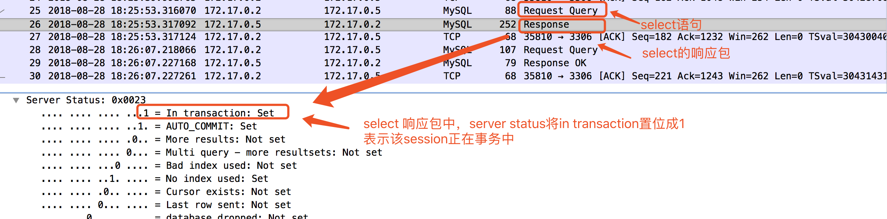

### MySQL设置全局autocommit=OFF/0时出现的问题及分析

#### 1 概述

Cetus是北京网易乐得DBA团队和SA团队联合打造的一款MySQL数据库中间件。Cetus具有读写分离版本和分库版本，已经部署在网易乐得部门众多线上MySQL集群，性能和稳定性均表现良好。其开源地址为:https://github.com/Lede-Inc/cetus，欢迎star关注。

本文主要介绍**MySQL端**设置全局autocommit=OFF/0时，cetus中间件产生的问题，以及cetus针对该场景做的优化处理。本文测试使用的是MySQL5.7，表的引擎均为innodb，隔离级别设置为**RC**（transaction-isolation=READ-COMMITTED）。

#### 2 MySQL的autocommit模式简单介绍

为了文章完整性，简单介绍下MySQL的autocommit的模式及配置方法，已经了解的读者可以跳过本章节。

MySQL**默认**操作模式是autocommit=ON/1的自动提交模式，该模式下除非显式的开始一个事务（begin/start transaction），否则每条sql都被当做一个单独的事务自动执行提交。如果设置autocommit=OFF/0，则必须使用commit语句提交之前的sql，或是使用rollback回滚。

该模式可以在MySQL配置文件中配置，或是动态的进行设置；该模式可以在某个会话（session）维度设置，也可以在全局（global）维度设置。

| session1      |    session2 |
| :--------: | :--------:|
| set autocommit=0  | set autocommit = 0 |
| insert into test values (1, 1) 可以查询到结果|    |
|      |    insert into test values (1, 1)查询不到结果 |
| commit |     |
|      |    insert into test values (1, 1)可以查询到结果 |

| session3      |    session4 |
| :--------: | :--------:|
| set autocommit=1  | set autocommit = 1 |
| insert into test values (1, 1) 可以查询到结果|    |
|      |    insert into test values (1, 1)可以查询到结果 |


#### 3 Cetus出现的问题分析及定位
##### 3.1 问题反馈
有cetus用户反馈以下两个问题：

1 开启cetus全量日志观察sql读写分离路由情况时，发现insert语句路由到了从库。
2 开启cetus主从延迟检测功能后，发现cetus并没有更新 心跳表（tb_heartbeat）。

- 问题1的全量日志内容如下：
(主库:172.17.0.3   从库:172.17.0.5)

```
2018-08-28 10:05:02.017: #backend-rw# C_ip:172.17.0.8:41324 C_db:ght C_usr:ght C_tx:false C_id:1 S_ip:172.17.0.5:3306 S_db:ght S_usr:ght S_id:40 inj(type:3 bytes:95 rows:7) latency:0.558(ms) OK type:Query select * from s
2018-08-28 10:06:40.249: #client# C_ip:172.17.0.8:41324 C_db:ght C_usr:ght C_tx:true C_retry:0 C_id:1 type:Query insert into s values ("test", 1024)
```

通过分析发现，select语句路由正常，路由到了从库（172.17.0.5）；而接下来的insert语句的路由十分诡异，日志中显示该insert路由到了从库（172.17.0.5），且当前session在事务中（c_tx:true）。

- 问题2的报错在cetus.log日志中，内容如下：

```
2018-08-28 10:06:42: (critical) Check slave delay no data:select p_ts from proxy_heart_beat.tb_heartbeat where p_id='/home/tsthght/cetus_install/conf_54321_12345'
```

从错误信息上分析，cetus在从库上查询心跳表数据时，没有查询到任何数据。这种现象主要有两种可能：1 主从同步有问题，主库上更新的心跳表的数据没有同步到从库；2 cetus更新主库的心跳表失败。

而查看主从复制时，发现复制正常，也没有复制延迟；在主库上查看心跳表，发现心跳表中没有任何数据，应该是cetus更新主库心跳表失败，但是cetus更新失败会有相关报错，但在日志中却没有任何更新心跳表报错失败的日志。

##### 3.2 问题分析与定位

问题1中，之所以insert语句被路由到了从库，应该与该连接在事务中有关系，为了搞清楚为什么该该处于事务中，tcpdump抓包如下：



通过上述抓包发现，`在事务中` 这个信息是MySQL端告诉给cetus的。

同样对问题2进行抓包分析，发现与上述类似，更新心跳表的update语句返回的结果中的server status的事务标志位被置位。

通过第2个问题，不难猜测到极有可能事务没有提交，才导致了更新心跳表成功，但查询不到数据的现象。因此用户配合查看当前MySQL的autocommit模式，发现被设置为了OFF，如下所示：

```
mysql> show global variables like '%autocommit%';
+---------------+-------+
| Variable_name | Value |
+---------------+-------+
| autocommit    | OFF   |
+---------------+-------+
1 row in set (0.00 sec)
```
至此，上述两个问题的最终祸根在于MySQL端设置了全局autocommit=OFF。将全局autocommit设置为ON，一切恢复正常。

#### 4 Cetus针对该场景的优化

该问题是由于MySQL端设置了全局autcommit=OFF导致，但是cetus对该类场景如何兼容保证正确呢？

究其原因是由于cetus判断当前连接是否在事务中仅仅依靠后端MySQL返回的server status，而没有再次确认当前连接是主库的连接还是从库的连接。

因此，我们修改了cetus相关代码，判断连接在事务中，不仅依据MySQL返回结果，还要再次确认，是否是与主库建立的连接。这样就完美的兼容了这个场景，不至于sql路由错误。相关代码修改已经合并到cetus主分支。

#### 5 总结

通过本文分析，发现这两个错误均是MySQL设置了全局autocommit=OFF/0导致的。因此，当使用autocommit=OFF/0模式时，建议尽量不要在MySQL端设置，而是在业务端设置，从而避免不必要的问题。
