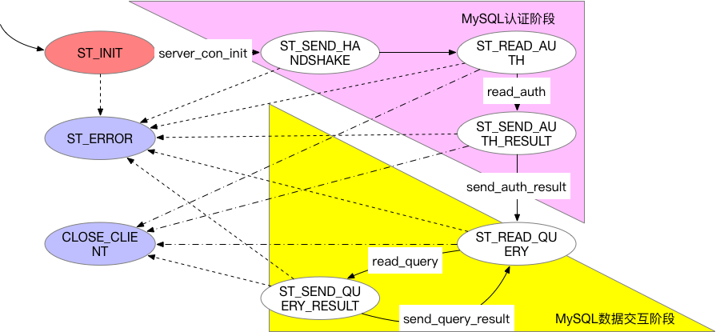

### Cetus的SQL处理状态机
#### 1 概述
Cetus是北京网易乐得DBA团队和SA团队联合打造的一款MySQL数据库中间件。Cetus具有读写分离版本和分库版本，已经部署在网易乐得部门众多线上MySQL集群，性能和稳定性均表现良好。其开源地址为:https://github.com/Lede-Inc/cetus，欢迎star关注。

本文主要对Cetus的SQL处理状态机进行介绍。

目前Cetus中间件对外提供两个端口：管理（admin）端口和代理（proxy）端口。管理端口用来对Cetus进行管理、监控，通过管理端口提供的API，用户可以修改Cetus的参数配置、查看状态监控等；代理端口用于提供对MySQL的透明化代理服务，用户连接代理端口可以正常的进行MySQL的各种操作。

无论是管理端口还是代理端口，Cetus都要接收用户发送过来的SQL，并将处理结果返回给用户。在处理SQL的过程中，使用了异步事件模式，因此需要对当前SQL处理的状态进行记录，并且根据SQL处理的不同阶段，进行相应的状态迁移。每一条SQL的处理的各阶段状态序列，其实便是状态机的迁移来表达的。接下来将会简单的分析Cetus的管理端口和代理端口的状态机。

#### 2 状态机入口

在介绍Cetus的SQL处理状态机之前，首先介绍一下每条SQL是如何进入状态机执行的。

Cetus中间件作为服务程序，会暴露给客户端相应的端口，即管理端口和代理端口，端口是通过配置文件中的`admin-address`和`proxy-address`参数分别配置的。Cetus会创建套接字(socket)来监听对应的端口，并且会对各个监听端口上的套接字描述文件注册事件回调函数，该函数便引导SQL进入状态机执行。

在Cetus中，注册的回调函数为`network_mysqld_con_accept`，该函数中主要完成套接字的accept功能，获取客户端连接的相关属性信息。在该函数中，会调用`network_mysqld_con_handle`函数，真正进入状态机，对SQL进行处理。

状态机内部，是通过状态的迁移而进行推进的，即每完成相应的操作，状态便进行迁移。虽然管理端口状态机和代理端口状态机有所不同，但是其入口均是`network_mysqld_con_handle`。

`network_mysqld_con_handle`的声明如下：

```
/**
 * handle the different states of the MySQL protocol
 *
 * @param event_fd     fd on which the event was fired
 * @param events       the event that was fired
 * @param user_data    the connection handle
 */
void
network_mysqld_con_handle(int event_fd, short events, void *user_data);
```


介绍状态机之前，首先介绍下客户端与服务器端通过MySQL协议交互的大致流程，因为只有了解MySQL协议交互流程，才能理解为什么状态机的各个状态如此迁移。


如上图所示，MySQL协议大致可以分为认证阶段和交互阶段。认证阶段服务器会首先发送握手包，客户端响应认证包，最后服务器会根据认证包中的信息，决定是否认证成功，发送给客户端OK包或是Err包。而认证通过之后，客户端便可以发送SQL请求，进行数据的存储。而且在客户端与Cetus交互过程中，Cetus便充当了服务器的角色；而当Cetus有后端MySQL交互过程中，Cetus却扮演了客户端的角色。

#### 3 管理端口状态机

管理端口状态机的状态转换如下图所示（忽略SSL协议状态），其中ST\_INIT状态（红色背景）是初始状态，ST\_ERROR状态和CLOSE\_CLIENT状态（紫色背景）为终止状态。所有SQL都是由初始状态开始，到终止状态结束。下面对**主要**的状态转换过程进行简单描述。



##### 3.1 ST\_INIT  ->  ST\_SEND\_HANDSHAKE

ST\_INIT状态执行admin插件中的函数`server_con_init`后，会迁移到ST\_SEND\_HANDSHAKE状态。`server_con_init`函数主要是组装handshake包。handshake包中会设置协议、版本号、权值标志、挑战数等等一系列信息。并将设置好的handshake包放入发送队列中，等待发送给客户端。

##### 3.2 ST\_SEND\_HANDSHAKE  ->  ST\_READ\_AUTH

进入ST\_SEND\_HANDSHAKE后，会将发送队列中的handshake包，**异步**的发送给客户端，随后便迁移至ST\_READ\_AUTH状态。

##### 3.3 ST\_READ\_AUTH  ->  ST\_SEND\_AUTH\_RESULT

进入ST\_READ\_AUTH状态后，会**异步**的读取客户端的认证包并放入接收队列中。一旦读取到认证包，会调用admin插件的`server_read_auth`函数。该函数会从接受队列中读取认证包进行解析。

认证包中主要包括客户端的权值、用户名、密码、是否启用压缩等信息。账号合法性检测和IP白名单、黑名单的检测均在该函数完成。只有允许的用户名和密码、允许的客户端IP才会向客户端恢复认证成功的消息包，认证失败则会发送响应的错误信息。这些成功或是失败的消息，同样会首先放入到发送队列中，等待后续发送给客户端。

经过认证包的解析，以及权限认证，会迁移到ST\_SEND\_AUTH\_RESULT状态。

##### 3.4 ST\_SEND\_AUTH\_RESULT  ->  ST\_READ\_QUERY

进入ST\_SEND\_AUTH\_RESULT状态后，会**异步**的将发送队列中的认证响应包发送给客户端。当然，在该状态转化过程中，也会判断客户端是否启用压缩，而设置压缩缓冲区等。完成上述转换过程，即完成了MySQL协议的认证过程，后续便可以进行正常的SQL访问了，状态会转换成ST\_READ\_QUERY，等待客户端发送SQL请求。

##### 3.5 ST\_READ\_QUERY  ->  ST\_SEND\_QUERY\_RESULT

进入ST\_READ\_QUERY状态后，会等待客户端发送SQL请求。一旦客户端发送了请求，便会进入了SQL请求的处理流程，该流程主要在函数`handle_read_query`中完成的。

首先肯定是**异步**读取客户端发送的**所有**的SQL请求，将接收到的请求发送接收队里中。随后，将接受缓冲区中的SQL请求经由词法和语法解析器识别，按照各个语句，调用响应的处理函数进行SQL的处理，并将响应结果放入发送队列中，该过程是在`admin_process_query`函数中完成的。处理完成之后，状态会迁移到ST\_SEND\_QUERY\_RESULT状态。

##### 3.6 ST\_SEND\_QUERY\_RESULT  ->  ST\_READ\_QUERY

ST\_SEND\_QUERY\_RESULT状态，主要是将发送队列中的SQL响应结果返回给客户端，该过程主要在`send_result_to_client`函数中完成。将结果集发送给客户端后，状态会迁移回ST\_READ\_QUERY状态，等待响应客户端发送来的下一条SQL请求。


#### 4 代理端口状态机

代理端口状态机与管理端口状态机相比较，流程类似但是更为复杂。管理端口状态机与客户端交互，并不涉及后端MySQL，而代理端口状态机与客户端交互时，还涉及到与后端MySQL的交互。因此，代理端口与Cetus交互，其实涉及三个节点：客户端、Cetus中间件、后端MySQL，交互流程示意如下。


交互过程会涉及后端MySQL，因此相比管理端口状态机，会有一些新增状态，主要状态变迁如下图所示。其中ST\_INIT状态（红色背景）是初始状态，ST\_ERROR状态和CLOSE\_CLIENT状态（紫色背景）为终止状态。所有SQL都是由初始状态开始，到终止状态结束。下面对**主要**的状态转换过程进行简单描述。


##### 4.1 ##### 3.1 ST\_INIT  ->  ST\_SEND\_HANDSHAKE


#### 5 结束语

本文仅针对Cetus的SQL处理状态机进行了简单描述，实际处理过程远比描述的复杂，甚至有些细节都已经略去，目的是让读者能够专注于对状态机的理解。有些重要细节，会在其他文章中进行详细介绍。

