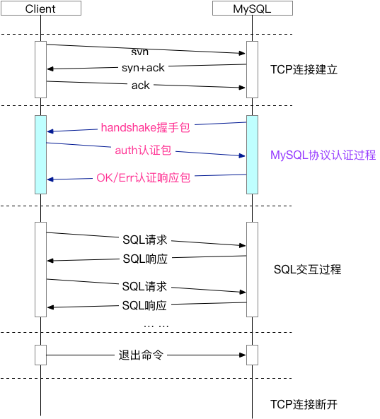
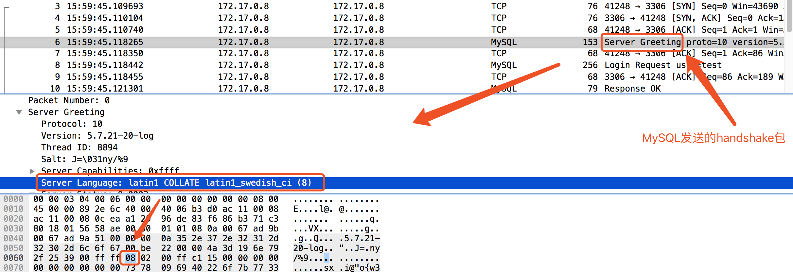
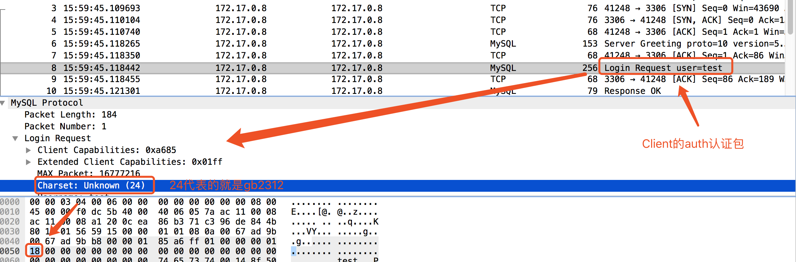
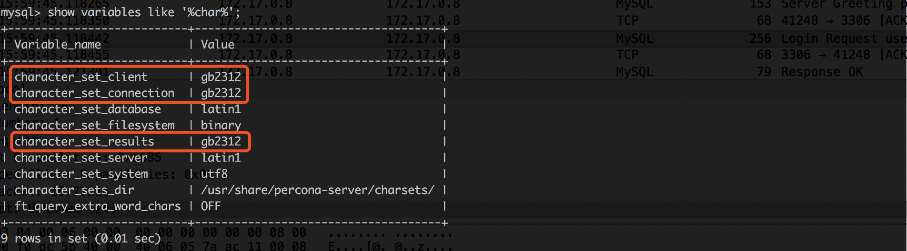
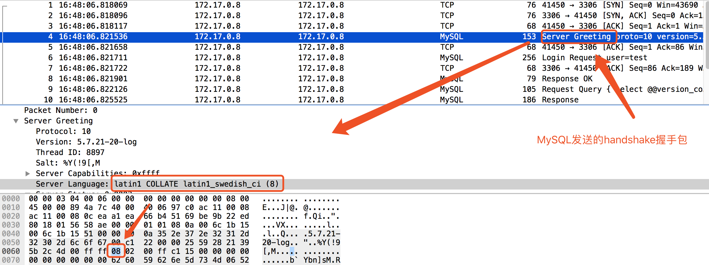
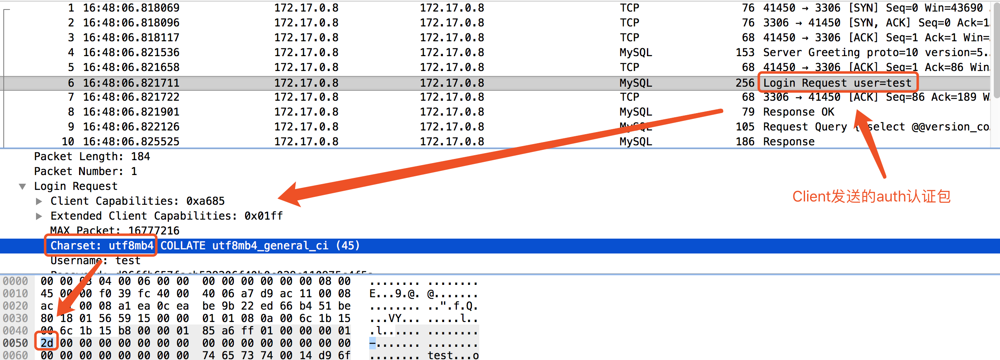
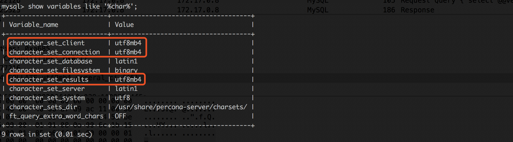

### Cetus默认字符集参数深入理解

#### 1 概述

Cetus是北京网易乐得DBA团队和SA团队联合打造的一款MySQL数据库中间件。Cetus具有读写分离版本和分库版本，已经部署在网易乐得部门众多线上MySQL集群，性能和稳定性均表现良好。其开源地址为:https://github.com/Lede-Inc/cetus，欢迎star关注。

本文首先对MySQL新建连接过程中，MySQL协议中的字符集相关字段进行介绍；随后对Cetus中默认字符集参数的含义进行说明。

#### 2 与MySQL新建连接时的协议交互

在介绍主题内容之前，首先对MySQL建立连接时的协议进行简单叙述。

MySQL协议是应用层协议，是需要建立在TCP连接之上的。因此与MySQL新建连接过程可以分为两个阶段：1 TCP连接建立 2 MySQL协议认证，本节重点在与字符集相关的MySQL协议描述。下图是MySQL交互的整体流程示意。



##### 2.1 字符集相关协议说明

TCP连接建立完成后，MySQL端首先向client端发送handshake握手包，其中便包含了server端默认的字符集（8Byte）。在**MySQL5.7**中，该默认字符集设置的是`latin1`。

```
CHARSET_INFO *default_charset_info = &my_charset_latin1;
```

客户端发送的auth认证包中，也包含了字符集（8Byte）。客户端可以使用参数`--default-character-set`指定默认的字符集，如果没有指定，会根据本地OS字符集（locale命令可查看）进行设置。

auth认证包中设置的该值，会影响MySQL的session级变量`character_set_client`、`character_set_connection`和`character_set_results`，其功能与SQL语句`set names xxx`一致。

##### 2.2 抓包分析(MySQL5.7.21)

- **case1 本地字符集设置为'zh_CN.gb2312'**

tcpdump抓包：

> mysql -utest -p -h172.17.0.8 --ssl-mode=disable

抓包发现，MySQL发送的handshake握手包中，设置的字符集是latin1；client返回的认证包中设置的字符集是gb2312；连接建立后，执行`show variables like '%char%'`发现，该session级`character_set_client`、`character_set_connection`和`character_set_results`变量被设置成了gb2312。







- **case2 本地字符集设置为'zh_CN.gb2312'，客户端设置参数`--default-character-set=utf8mb4`**

tcpdump抓包：

> mysql -utest -p -h172.17.0.8 --default-character-set=utf8mb4 --ssl-mode=disable

抓包发现，MySQL发送的handshake握手包中，设置的字符集是latin1；client返回的认证包中设置的字符集是utf8mb4；连接建立后，执行`show variables like '%char%'`发现，该session级`character_set_client`、`character_set_connection`和`character_set_results`变量被设置成了utf8mb4。








#### 3 Cetus默认字符集参数

Cetus启动时，可以通过参数`default-charset=xxx`配置默认字符集，该值默认为`utf8`。在Cetus中，目前该参数支持的字符集有：big5、latin1、gb2312、gbk、utf8、utf8mb4和binary。如果该参数配置的值是Cetus不支持的字符集，Cetus会将字符集设置为默认值`utf8`。

该默认字符集参数，主要有两个作用：1 当客户端使用的字符集是Cetus不支持的字符集时，会将客户端的字符集设置为`default-charset`; 2 Cetus启动时，预热连接池中连接时，使用的字符集也是`default-charset`。

因此，在Cetus中配置`default-charset`时，需要注意两点：1 配置参数时，要选择Cetus支持的字符集配置，不然可能会与期望不符。 2 该参数配置要尽量与实际Client连接使用的字符集一致，不然可能会造成不必要的性能损耗（Cetus会校正session级变量，其中就包括字符集）。

#### 4 结束语

本文从协议层面分析了MySQL连接建立时字符集相关的设置，有助于抓包对MySQL协议的分析；在此基础上对Cetus中默认字符集的参数的含义进行了说明，从而有助于更好的理解中间件、更好的进行Cetus的运维。


