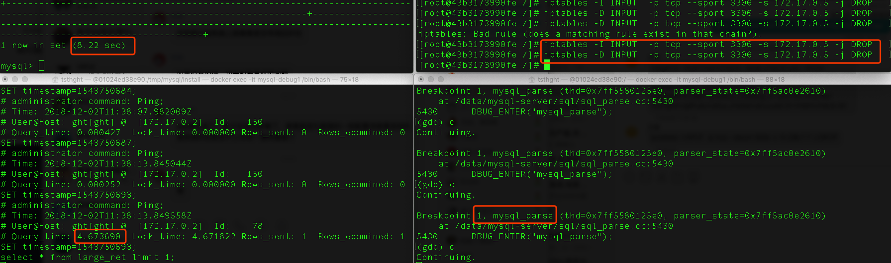
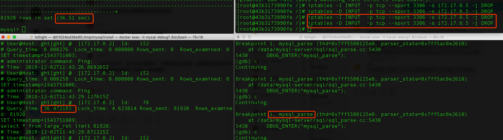
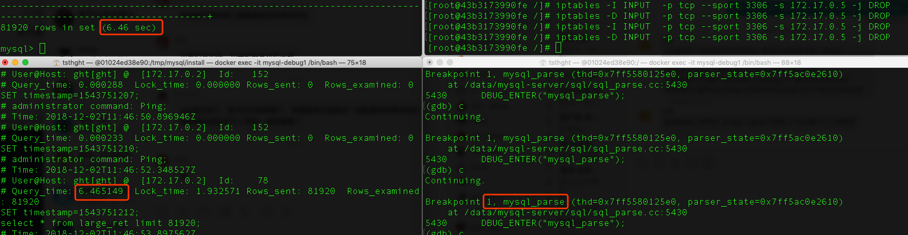

###  slow log 中的Query_time和网络的关系

#### 1 问题描述

Cetus群里有用户反馈，通过公网ssh隧道执行SQL，在MySQL慢日志中有记录；而在MySQL本地执行同样的SQL却没有。用户感觉慢查询的计算可能与网络状况有关系。

因此，接下来我们将通过测试，来判断是否慢日志中记录的执行时间是否收到网络的影响。

#### 2 问题分析

这个问题的关键其实就是，计算慢日志的时刻，是在网络IO之前，还是之后；如果在网络IO之后，那么发送缓冲区写满之后，是否需要等待发送缓冲区重新可写才能继续将剩余结果集发送。

分两种情况来讨论： 1 SQL执行的结果集小于TCP发送缓冲区 2 SQL执行的结果集大于TCP发送缓冲区。

#### 3 测试过程

##### 3.1 测试方案
- step1: 在MySQL打断点，阻止SQL结果集返回；
- step2: 此时在mysql客户端通过iptables阻止结果集的返回；
- step3: 然后将断点继续运行；
- step4: 查看慢日志中记录时间。

##### 3.2 结果集小的SQL

现象是：如果断点继续，即可在slowlog中打印信息。iptables解封后，客户端才返回信息。

##### 3.3 结果集大(10M左右)的SQL

现象是：如果断点继续，等待一段时间，让酒没有slowlog输出；iptables解封后，打印出slowlog，随后客户端返回信息。

为了验证，等待时间是否够够长，在不设置iptables的时候，再测试一次，对下时间。

从上图中看出，实际该SQL应该执行6秒左右（包括认为操作断点时间）就可以记录slowlog并且返回。

##### 4 测试结论

可能是结果集大小小于TCP缓冲区大小时，与网络没关系；结果集大于TCP缓冲区时，会等待缓冲区可用，将全部结果集写入缓冲区后，才会记录slow log，因此大结果集场景下，可能由于网络抖动等原因会增加SQL执行时间。