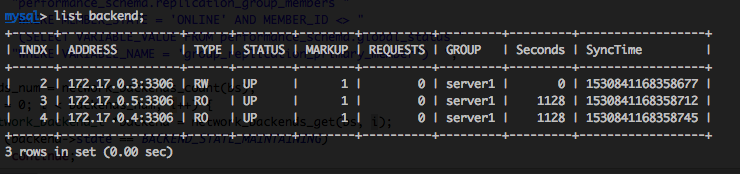
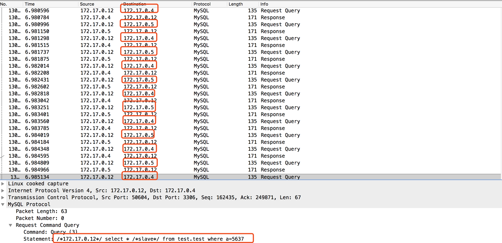
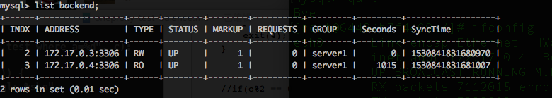
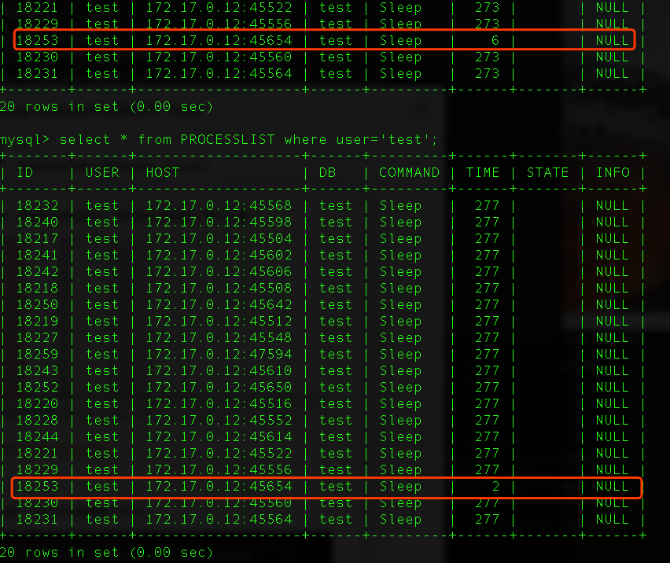

### OneProxy中负载均衡的两点优化的测试
#### 1 测试目的
Cetus在负载均衡模块中，进行了两点优化：1 客户端同一个连接连续发送SQL时不会切换后端连接；2 放入连接池的空闲连接会被优先再次使用。

本测试主要通过测试，探索OneProxy是否在这两点上也做了类似优化。

#### 2 测试方案
##### 2.1 case 1
OneProxy配置两台从库，客户端使用同一个连接不断发送查询SQL。对OneProxy到后端MySQL的链路抓包，查看实际SQL路由情况。

如果抓包显示均路由到其中一台从库，则对该场景进行了优化；如果均衡路由到了两台从库，则没有对该场景进行优化。

##### 2.2 case 2
OneProxy配置一台从库，且与后端建立足够多的连接。使用两个客户端连接分别连接OneProxy，并发送查询SQL。在从库上通过`show processlists;`查看使用的连接情况。

通过case1 可以推断，OneProxy发送完一条查询SQL之后，会将后端的连接放回连接池复用。通过在从库上观察从库的各个连接的空闲情况，便可以推断出该连接是否被优先再次使用。

如果从库上只有一个连接的空闲时间较短，则说明该连接被OneProxy再次使用了；如果有两个空闲时间都较短，则说明并非优先被使用。

#### 3 测试环境
##### 3.1 OneProxy的配置
OneProxy配置如下图所示。


##### 3.2 测试代码片段

```
while(1) {
    char str[120] = {""};
    sprintf(str, "select * /*slave*/ from test.test where a=%d", c);
    c++;
    if (mysql_real_query(sql, str, strlen(str))) {
        printf("mysql_real_query failed: %s, sql: %s\n", mysql_error(sql), str);
        exit(3);
    }
    MYSQL_RES *res = mysql_store_result(sql);
    if (!res) {
        printf("mysql_store_result failed: %s", mysql_error(sql));
        exit(4);
    }


    //if(c%2 == 0) {
    //    sleep(1);
    //}
}

```

#### 4 测试结果
##### 4.1 case 1
通过抓包发现，客户端统一连接发送来的SQL，被均衡的路由到了两个从库上。



##### 4.2 case 2
该测试时，仅配置一个从库，OneProxy配置如下所示。



客户端使用两个连接依次交替连接OneProxy，在从库上发现，只要一个连接被使用。因此可以推断连接被再次优先使用。



